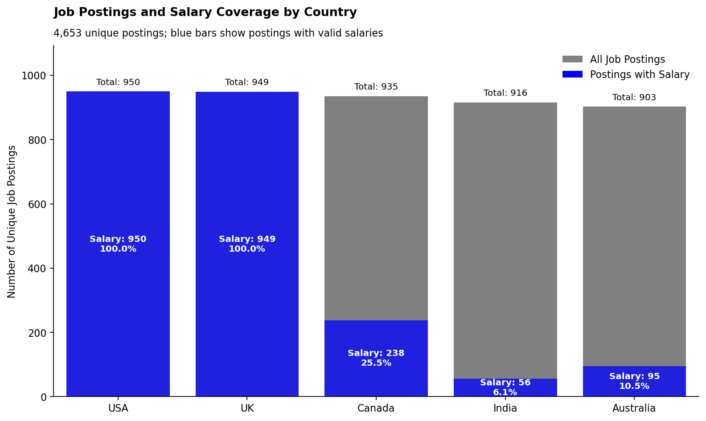
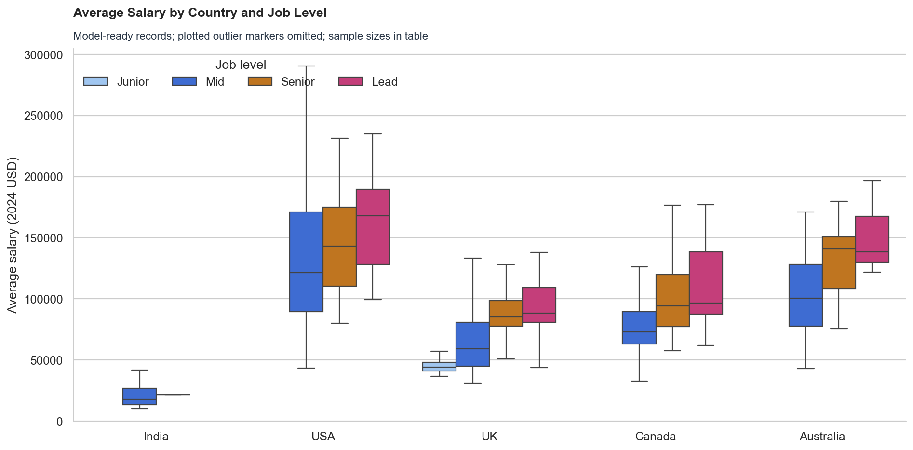

# 💼 TalentPulse — Global Tech Salary Intelligence

An end-to-end machine-learning project that turns global technology job-posting data into explainable salary benchmarks. TalentPulse cleans and validates 4,653 postings, engineers leakage-safe features, compares regression models, and delivers salary estimates through an interactive Streamlit app.

[](https://www.python.org/)
[](https://pandas.pydata.org/)
[](https://scikit-learn.org/)
[](https://streamlit.io/)
[](https://jupyter.org/)

### [🚀 Try the live salary estimator](https://tatejoseph123-talentpulse-salary-p-salary-prediction-app-i68iod.streamlit.app/)

---

## 📌 Overview

Salary data in international job postings is incomplete, inconsistent, and recorded in different currencies. TalentPulse builds a reproducible workflow that standardizes this information and estimates annual technology salaries in 2024 USD using job location, seniority, work arrangement, experience, and skills.

The final model is designed as a **salary-review and benchmarking aid**. It supports human decisions; it does not automate compensation, hiring, or promotion decisions.

## 🎯 Business Problem

Technology employers and job seekers need credible salary benchmarks, but advertised compensation is often missing or difficult to compare across markets. This project addresses two questions:

1. Which job and market characteristics are most useful for explaining salary differences?
2. Can a machine-learning model estimate salary accurately enough to improve on the existing **$18,500 MAE** benchmark?

A useful solution can help teams:

- identify roles that may need compensation review;
- compare salaries consistently across five countries;
- explore the relationship between seniority, skills, location, and pay; and
- flag unusual estimates for human investigation.

## 🗂️ Dataset

The source dataset contains **4,653 technology job postings** from the USA, UK, Canada, India, and Australia across **17 original fields**.

| Category | Fields used or reviewed |
|---|---|
| Job context | `job_title`, `job_level`, `company`, `location`, `country` |
| Work profile | `is_remote`, `experience_required`, `degree_required` |
| Skills | `skills`, `num_skills`, Python, SQL, AWS, Spark, Excel, ML, Power BI, Tableau |
| Salary | `salary_min`, `salary_max`, `salary_avg`, `has_salary` |
| Administration | `job_id`, `search_keyword` |

Missing salary targets were **not imputed**. Labeled postings were retained for modeling, unlabeled records were preserved as a future scoring pool, and questionable salary records were separated for review. Direct salary components and identifiers were excluded from model inputs to prevent leakage.



## 🛠️ Tech Stack

| Category | Tools |
|---|---|
| Language | Python 3 |
| Data preparation | pandas, NumPy |
| Visualization | Matplotlib, Seaborn |
| Machine learning | scikit-learn |
| Model persistence | joblib |
| Application | Streamlit |
| Development | Jupyter Notebook |

## 🔄 Project Workflow

1. **Data validation** — checked schema, missingness, duplicates, salary bounds, and experience values.
2. **Salary standardization** — converted local salaries into 2024 USD using fixed exchange rates documented in the notebook.
3. **Data separation** — retained valid labeled rows for training, preserved missing-target rows for scoring, and isolated questionable salaries for review.
4. **Feature engineering** — created experience tiers and skill indicators while excluding identifiers and direct salary fields.
5. **Preprocessing** — encoded categorical variables and prepared numeric features inside reusable pipelines.
6. **Model comparison** — evaluated Linear Regression, Random Forest, and Gradient Boosting with five-fold cross-validation.
7. **Model diagnostics** — reviewed feature sets, permutation importance, multicollinearity, residuals, outliers, and target skewness.
8. **Tuning and evaluation** — tuned the strongest candidate, applied a log-target transformation, and evaluated it once on an untouched 20% test set.
9. **Deployment** — saved the validated pipeline and exposed it through a Streamlit interface.

## 📊 Model Performance

The selected model is a tuned **Random Forest regression pipeline** trained on a log-transformed salary target.

| Metric | Untouched 20% test set |
|---|---:|
| Mean Absolute Error (MAE) | **$23,374.50** |
| Root Mean Squared Error (RMSE) | **$32,385.28** |
| R² | **0.610** |

The model explains approximately **61% of the observed salary variation**. It improves on simple baselines but does **not** beat the legacy $18,500 MAE benchmark, so it is best treated as a decision-support prototype rather than a production compensation engine.



## 💡 Key Findings & Insights

- **Country is highly influential.** Market location explains a substantial share of salary variation and also requires fairness review before operational use.
- **Seniority generally raises salary.** Mid, senior, and lead roles tend to command higher pay, although coverage varies by country and level.
- **Salary-label coverage is uneven.** The USA and UK have complete salary coverage in this dataset, while Canada, India, and Australia are much more sparsely labeled.
- **The log target improves modeling stability.** Salary is right-skewed, so modeling its logarithm reduces the influence of extreme values.
- **The benchmark remains unmet.** Better role, company, pay-period, and fresher market data are the clearest paths toward lower error.

## 📁 Repository Structure

```text
.
├── My Capstone Project_Rearranged.ipynb  # Authoritative executed analysis
├── Salary_prediction_app.py              # Streamlit user interface
├── salary_prediction_pipeline.pkl        # Validated fitted pipeline
├── feature_columns.pkl                    # Model input feature list
├── jobs_dataset.csv                       # Notebook-compatible source data
├── data/
│   ├── raw/                               # Structured source data
│   └── processed/                         # Training, scoring, and review outputs
├── notebooks/                             # Supporting staged notebooks
├── reports/figures/                       # Analytical visualizations
├── scripts/                               # Reproducibility scripts
├── references/                            # Original case-study brief
└── docs/                                  # Report, model card, and data dictionary
```

## ▶️ Run Locally

```powershell
python -m venv .venv
.\.venv\Scripts\Activate.ps1
python -m pip install --upgrade pip
pip install -r requirements.txt
streamlit run Salary_prediction_app.py
```

To open the full analysis:

```powershell
jupyter lab "My Capstone Project_Rearranged.ipynb"
```

## 📚 Documentation

- [Project report](docs/PROJECT_REPORT.md)
- [Data dictionary](docs/DATA_DICTIONARY.md)
- [Model card](docs/MODEL_CARD.md)
- [Reproducibility guide](docs/REPRODUCIBILITY.md)
- [Contributing guide](CONTRIBUTING.md)
- [Security policy](SECURITY.md)

## ⚖️ Responsible Use

TalentPulse provides point estimates without calibrated uncertainty intervals. Its historical data covers only five countries and has uneven salary-label coverage. Use current market evidence, subgroup validation, legal requirements, and human review before making compensation decisions.

## 📄 License

No open-source license has been specified. See [LICENSE](LICENSE) before reuse or redistribution.
